# Prosper Loan Data Analysis
## Exploratory & Explanatory Data Analysis — Udacity Data Analyst Nanodegree

<div align="center">


[](https://opensource.org/licenses/MIT)


**113,937 loans · 81 variables · 2005–2014 · 45 visualisations · 11 engineered features**

</div>

---

## Table of Contents

1. [Project Overview](#-project-overview)
2. [Research Questions](#-research-questions)
3. [Dataset](#-dataset)
4. [Repository Structure](#-repository-structure)
5. [Architecture](#️-architecture)
6. [Feature Engineering](#-feature-engineering)
7. [Key Findings Summary](#-key-findings-summary)
8. [Visualisation Catalogue](#-visualisation-catalogue)
9. [Installation & Usage](#-installation--usage)
10. [Full Dataset Usage](#-full-dataset-usage)
11. [Rubric Compliance](#-rubric-compliance)
12. [Limitations & Caveats](#-limitations--caveats)
13. [Future Research](#-future-research)
14. [References](#-references)

---

## Project Overview

This project is a **two-part data visualisation investigation** of the Prosper Marketplace loan dataset, conducted as part of the Udacity Data Analyst Nanodegree. Prosper Marketplace was the United States' first peer-to-peer (P2P) lending platform, connecting individual borrowers directly to retail investors.

The project addresses a fundamental question in consumer finance:

> **What factors determine the interest rate a Prosper borrower receives, and which of those same factors predict whether the loan will default?**

Understanding this question has direct value for both sides of the marketplace:
- **Borrowers** can identify which profile attributes increase their cost of credit and take targeted corrective action.
- **Investors** gain interpretable, data-driven signals to distinguish performing loans from those likely to default.

### Deliverables

| File | Description | Charts |
|---|---|---|
| `Part_I_exploration.ipynb` | Full exploratory analysis with Q→V→O framework | 29 |
| `Part_II_slide_deck.ipynb` | Polished explanatory slide deck (Reveal.js) | 16 |
| `README.md` | This file — full project documentation | — |
| `Prosper_Loan_Analysis_Report.docx` | Comprehensive written report | — |

---

## Research Questions

The analysis is guided by six progressive research questions:

1. What do the distributions of borrower rates, loan amounts, credit scores, and DTI reveal about the Prosper borrower population?
2. How strongly does Prosper's internal risk rating (AA→HR) drive borrower rate and loan default probability?
3. What role do credit-bureau variables — credit score, DTI, bankcard utilisation, delinquency history — play in rate-setting and outcomes?
4. How do borrower demographics (income, employment, homeownership, occupation) interact with loan pricing?
5. How have loan volumes, average rates, and risk profiles evolved across origination years 2005–2014?
6. What multivariate interactions emerge when combining risk tier, credit behaviour, affordability stress, and temporal factors?

---

## Dataset

### Source
- **Name:** Prosper Marketplace Loan Data
- **URL:** `https://s3.amazonaws.com/udacity-hosted-downloads/ud651/prosperLoanData.csv`
- **Size:** 82.5 MB (CSV)
- **Licence:** Public / Udacity-hosted for educational use

### Dimensions

| Attribute | Value |
|---|---|
| Total rows | 113,937 loans |
| Total columns | 81 variables |
| Analysis sample | 10,000 rows (8.8% stratified sample) |
| Date range | November 2005 – March 2014 |
| Bad-loan rate | 15.0% (Charged-off + Defaulted) |
| Mean borrower rate | 19.3% |
| Median borrower rate | 18.2% |
| Mean loan amount | $8,381 |

### Variable Groups

| Group | Variables | Examples |
|---|---|---|
| **Loan Terms** | 8 | `LoanOriginalAmount`, `BorrowerRate`, `BorrowerAPR`, `Term`, `MonthlyLoanPayment` |
| **Prosper Risk Model** | 6 | `ProsperRating (Alpha)`, `ProsperScore`, `EstimatedLoss`, `EstimatedReturn` |
| **Credit Bureau** | 18 | `CreditScoreRangeLower/Upper`, `DebtToIncomeRatio`, `BankcardUtilization`, `CurrentDelinquencies`, `TotalInquiries` |
| **Demographics** | 12 | `IncomeRange`, `StatedMonthlyIncome`, `EmploymentStatus`, `IsBorrowerHomeowner`, `Occupation` |
| **Performance** | 9 | `LoanStatus`, `LP_GrossPrincipalLoss`, `LoanCurrentDaysDelinquent` |
| **Metadata** | 6 | `LoanOriginationDate`, `LoanOriginationQuarter`, `LoanKey` |

### Rating System Note

 **Two overlapping rating systems exist in this dataset:**
> - **Pre-2009 loans (~25%):** Use `CreditGrade` (AA, A, B, C, D, E, HR, NC)
> - **Post-2009 loans (~75%):** Use `ProsperRating (Alpha)` (AA, A, B, C, D, E, HR)
>
> These are analysed separately for all rating-dependent visualisations.

### Prosper Rating Performance Summary

| Rating | Median Rate | Default Rate | n (sample) |
|---|---|---|---|
| **AA** | 7.9% | 0.6% | 478 |
| **A** | 11.2% | 3.1% | 1,306 |
| **B** | 15.1% | 3.5% | 1,387 |
| **C** | 19.1% | 4.3% | 1,646 |
| **D** | 25.0% | 13.0% | 1,211 |
| **E** | 29.6% | 14.6% | 863 |
| **HR** | 31.8% | 19.4% | 599 |

> HR borrowers default at **~30× the rate of AA borrowers** (19.4% vs 0.6%).

---

## Repository Structure

```
prosper-loan-analysis/
│
├──  Part_I_exploration.ipynb           # Exploratory analysis — 29 visualisations
├──  Part_II_slide_deck.ipynb           # Explanatory slide deck — 16 visualisations
│
├──  README.md                          # This file
├──  Prosper_Loan_Analysis_Report.docx  # Full written report
│
├──  data/
│   └── loan_subset_data.csv              # 10,000-row working sample
│       # Full dataset (113,937 rows):
│       # https://s3.amazonaws.com/udacity-hosted-downloads/ud651/prosperLoanData.csv
│
└──  outputs/
    ├── Part_I_exploration.html           # HTML export of exploratory notebook
    └── Part_II_slide_deck.slides.html    # Reveal.js slide deck export
```

---

##  Architecture

### Data Science Flow — System Architecture Diagram

```mermaid
flowchart TD
    %% ─────────────────────────────────────────────────────────────────
    %% NODE DEFINITIONS
    %% ─────────────────────────────────────────────────────────────────

    %% Layer 1 — Data Source
    SRC1(["🌐 Prosper Marketplace
S3 Hosted CSV"])
    SRC2(["📋 113,937 Loans · 81 Variables
2005 – 2014"])

    %% Layer 2 — Ingestion
    ING1["📥 load_prosper()
pd.read_csv()"]
    ING2["🔤 Ordered Categoricals
ProsperRating AA→HR · IncomeRange · Term"]
    ING3["📅 Date Parsing
LoanOriginationDate · FirstRecordedCreditLine"]
    RAW[("💾 prosperLoanData.csv
113,937 rows × 81 cols")]

    %% Layer 3 — Data Quality Assessment
    VASS["👁️ Visual Assessment
df.head() · df.sample()
df.info() · df.dtypes"]
    PASS["🔢 Programmatic Assessment
df.describe() · isnull().sum()
value_counts() · duplicated()"]
    QI1["⚠️ Quality Issue 1
25% missing ProsperRating
pre-2009 CreditGrade only"]
    QI2["⚠️ Quality Issue 2
DTI outliers > 1.0
(debt exceeds income)"]
    QI3["⚠️ Quality Issue 3
Age-censored 2013–14 loans
near-zero apparent defaults"]
    TI1["⚠️ Tidiness Issue
Two rating systems
CreditGrade vs ProsperRating"]

    %% Layer 4 — Cleaning
    CL1["✅ Cohort Separation
Pre-2009 CreditGrade
Post-2009 ProsperRating"]
    CL2["✅ Outlier Clipping
DTI capped ≤ 1.0
BankcardUtil capped ≤ 1.5"]
    CL3["✅ Correlation Fix
corr(min_periods=500)
pre-2009 rows contribute"]
    CL4["✅ Censoring Flag
Document 2013–14 artefact
not improved quality"]

    %% Layer 5 — Feature Engineering
    FE1["⚙️ BadLoan
1 = Chargedoff OR Defaulted
binary outcome variable"]
    FE2["⚙️ CreditScoreMid
(Lower + Upper) / 2
continuous FICO proxy"]
    FE3["⚙️ ★ LoanToIncomeRatio
MonthlyPayment ÷ MonthlyIncome
affordability stress signal"]
    FE4["⚙️ OriginationYear
CreditHistoryYears
AnyDelinquency · LoanCategory"]
    MERGE["🔗 Analysis-Ready Dataset
113,937 rows · 92 columns
81 original + 11 engineered"]

    %% Layer 6 — Statistical Analysis
    ST1["📐 Pearson Correlations
CreditScore  r = −0.47
BankcardUtil r = +0.24
DTI          r = +0.18"]
    ST2["📐 Spearman Correlation
ProsperScore vs EstimatedLoss
r = −0.70  (p < 0.001)"]
    ST3["📐 Significance Tests
t-tests · OLS regression
95% confidence intervals"]

    %% Layer 7 — Exploratory Analysis
    UV["📊 Univariate — 11 charts
Histogram · Countplot
Bar · Dual-axis time series
All key variable distributions"]
    BV["📊 Bivariate — 8 charts
Scatter · Boxplot · Violin
Heatmap · Dual bar chart
Rate & BadLoan vs each predictor"]
    MV["📊 Multivariate — 10 charts
Facet · PairGrid · Bubble scatter
Interaction heatmaps
Multi-encoding scatter"]

    %% Layer 8 — Key Insights
    KI1["💡 Rating is Master Signal
AA 7.9% → HR 31.8%
HR defaults 30× more than AA"]
    KI2["💡 LoanToIncomeRatio
C-tier: 5.5% default (LTI <5%)
vs 26.3% (LTI >20%) — near 5×"]
    KI3["💡 Platform Temporal Effects
Pre-2010 genuine mis-pricing
2013–14 = censoring artefact"]

    %% Layer 9 — Explanatory Slides
    SL1["🎯 Slides 1–8
Rating staircase · ProsperScore
Bureau signals · Homeownership
Delinquency · LTI heatmap
Term strategies · Emp × Income"]
    SL2["🎯 Slides 9–16
Platform timeline · Year × Rating
Category risk · Correlation matrix
Occupation risk · Score trajectory
Factor hierarchy waterfall"]

    %% Layer 10 — Outputs
    OP1[("📤 Part_I_exploration
.ipynb  /  .html
29 visualisations
Q→V→O narrative")]
    OP2[("📤 Part_II_slide_deck
.ipynb  /  .slides.html
16 polished charts
Reveal.js · Speaker notes")]
    OP3[("📄 Report.docx
10 sections · 16 figures
Academic references
WCAG accessible")]

    %% ─────────────────────────────────────────────────────────────────
    %% EDGES
    %% ─────────────────────────────────────────────────────────────────

    SRC1 --> ING1
    SRC2 --> ING1
    ING1 --> ING2
    ING1 --> ING3
    ING2 --> RAW
    ING3 --> RAW

    RAW --> VASS
    RAW --> PASS

    VASS --> QI1
    VASS --> QI2
    VASS --> QI3
    VASS --> TI1
    PASS --> QI1
    PASS --> QI2
    PASS --> QI3
    PASS --> TI1

    QI1 --> CL1
    QI2 --> CL2
    QI3 --> CL4
    TI1 --> CL1
    QI1 --> CL3

    CL1 --> FE1
    CL2 --> FE2
    CL3 --> FE3
    CL4 --> FE4

    FE1 --> MERGE
    FE2 --> MERGE
    FE3 --> MERGE
    FE4 --> MERGE

    MERGE --> ST1
    MERGE --> ST2
    MERGE --> ST3

    ST1 --> UV
    ST2 --> UV
    ST3 --> UV

    UV --> BV
    BV --> MV

    MV --> KI1
    MV --> KI2
    MV --> KI3

    KI1 --> SL1
    KI2 --> SL1
    KI3 --> SL1
    SL1 --> SL2

    UV --> OP1
    BV --> OP1
    MV --> OP1
    SL1 --> OP2
    SL2 --> OP2
    SL2 --> OP3

    %% ─────────────────────────────────────────────────────────────────
    %% STYLES — each layer gets its own distinct color palette
    %% ─────────────────────────────────────────────────────────────────

    %% Layer 1 — Data Source: deep teal
    classDef sourceStyle fill:#0D5C6E,stroke:#07404E,color:#E0F7FA,font-weight:bold

    %% Layer 2 — Ingestion: sky blue
    classDef ingestionStyle fill:#1976D2,stroke:#0D47A1,color:#E3F2FD,font-weight:bold

    %% Layer 2 — Raw Storage: steel blue / cylinder
    classDef rawStyle fill:#455A64,stroke:#263238,color:#ECEFF1,font-weight:bold

    %% Layer 3 — Assessment tools: violet
    classDef assessStyle fill:#6A1B9A,stroke:#4A148C,color:#F3E5F5,font-weight:bold

    %% Layer 3 — Issues: amber warning
    classDef issueStyle fill:#E65100,stroke:#BF360C,color:#FFF3E0,font-weight:bold

    %% Layer 4 — Cleaning: green
    classDef cleanStyle fill:#2E7D32,stroke:#1B5E20,color:#E8F5E9,font-weight:bold

    %% Layer 5 — Feature Engineering: gold
    classDef featureStyle fill:#F57F17,stroke:#E65100,color:#FFF8E1,font-weight:bold

    %% Layer 5 — Merge / Dataset: brown
    classDef mergeStyle fill:#795548,stroke:#4E342E,color:#EFEBE9,font-weight:bold

    %% Layer 6 — Statistical Analysis: deep purple
    classDef statsStyle fill:#4527A0,stroke:#311B92,color:#EDE7F6,font-weight:bold

    %% Layer 7 — Exploratory Analysis: navy blue
    classDef exploreStyle fill:#1A237E,stroke:#0D1B6E,color:#E8EAF6,font-weight:bold

    %% Layer 8 — Key Insights: dark gold / olive
    classDef insightStyle fill:#827717,stroke:#558B2F,color:#F9FBE7,font-weight:bold

    %% Layer 9 — Explanatory Slides: crimson
    classDef slideStyle fill:#880E4F,stroke:#560027,color:#FCE4EC,font-weight:bold

    %% Layer 10 — Outputs: forest green / cylinder
    classDef outputStyle fill:#1B5E20,stroke:#0A3D0A,color:#C8E6C9,font-weight:bold

    %% ─────────────────────────────────────────────────────────────────
    %% CLASS ASSIGNMENTS
    %% ─────────────────────────────────────────────────────────────────
    class SRC1,SRC2 sourceStyle
    class ING1,ING2,ING3 ingestionStyle
    class RAW rawStyle
    class VASS,PASS assessStyle
    class QI1,QI2,QI3,TI1 issueStyle
    class CL1,CL2,CL3,CL4 cleanStyle
    class FE1,FE2,FE3,FE4 featureStyle
    class MERGE mergeStyle
    class ST1,ST2,ST3 statsStyle
    class UV,BV,MV exploreStyle
    class KI1,KI2,KI3 insightStyle
    class SL1,SL2 slideStyle
    class OP1,OP2,OP3 outputStyle
```



### Layer Descriptions

| Layer | Colour | Node IDs | Responsibility |
|---|---|---|---|
| 🟦 **Data Source** | Deep Teal `#0D5C6E` | SRC1, SRC2 | External source — Prosper Marketplace S3 CSV |
| 🔵 **Ingestion** | Sky Blue `#1976D2` | ING1, ING2, ING3 | Programmatic load, type conversions, date parsing |
| ⬛ **Raw Storage** | Steel Blue `#455A64` | RAW | Immutable CSV snapshot before any transformation |
| 🟣 **Assessment** | Violet `#6A1B9A` | VASS, PASS | Visual and programmatic quality / tidiness profiling |
| 🟠 **Issues** | Amber `#E65100` | QI1–QI3, TI1 | Documented quality and tidiness problems identified |
| 🟢 **Cleaning** | Green `#2E7D32` | CL1–CL4 | Targeted issue resolution with documented rationale |
| 🟡 **Feature Engineering** | Gold `#F57F17` | FE1–FE4 | 11 derived variables; ★ LoanToIncomeRatio key innovation |
| 🟫 **Merge** | Brown `#795548` | MERGE | Analysis-ready dataset: 113,937 rows × 92 columns |
| 🔷 **Statistical Analysis** | Deep Purple `#4527A0` | ST1–ST3 | Pearson r, Spearman r, t-tests, OLS, 95% CIs |
| 🔵 **Exploratory Analysis** | Navy Blue `#1A237E` | UV, BV, MV | 29 charts across Univariate → Bivariate → Multivariate tiers |
| 🌿 **Key Insights** | Olive Gold `#827717` | KI1–KI3 | 3 primary findings driving the explanatory narrative |
| 🔴 **Explanatory Slides** | Crimson `#880E4F` | SL1, SL2 | 16 polished Reveal.js slides with speaker notes |
| 🌲 **Outputs** | Forest Green `#1B5E20` | OP1–OP3 | HTML report, slide deck, Word document |


---

## Feature Engineering

Eleven derived variables were engineered before any analysis. All are vectorised and scale to the full 113,937-row dataset.

| # | Feature | Formula | Purpose |
|---|---|---|---|
| 1 | `BadLoan` | `1 if LoanStatus in {Chargedoff, Defaulted}` | Binary default outcome variable |
| 2 | `CreditScoreMid` | `(CreditScoreRangeLower + Upper) / 2` | Continuous FICO proxy for scatter/regression |
| 3 | `LoanToIncomeRatio` ⭐ | `MonthlyLoanPayment ÷ StatedMonthlyIncome` | **Affordability stress** — independent of creditworthiness |
| 4 | `OriginationYear` | `LoanOriginationDate.dt.year` | Temporal trend analysis |
| 5 | `CreditHistoryYears` | `(OriginationDate − FirstRecordedCreditLine) / 365.25` | Credit seasoning as a risk signal |
| 6 | `AnyDelinquency` | `1 if CurrentDelinquencies > 0` | Binary delinquency flag for within-tier analysis |
| 7 | `NetLoss` | `LP_GrossPrincipalLoss − LP_NonPrincipalRecoverypayments` | True investor loss after recoveries |
| 8 | `APR_Rate_Spread` | `BorrowerAPR − BorrowerRate` | Platform fee / overhead proxy |
| 9 | `UtilisationTier` | `pd.cut(BankcardUtilization, [0, 0.25, 0.50, 0.75, ∞])` | Categorical utilisation for group comparisons |
| 10 | `LoanCategory` | Map from `ListingCategory (numeric)` to human-readable text | Interpretable loan purpose labels |
| 11 | `AnnualIncome` | `StatedMonthlyIncome × 12` | Annual income for cross-comparisons |

> ⭐ **Standout feature:** `LoanToIncomeRatio` proved the most analytically novel. Within any identical Prosper rating tier, borrowers with LTI > 20% default at substantially higher rates than those with LTI < 5% — demonstrating that **affordability stress and creditworthiness are two distinct, additive risk dimensions** not fully captured by the existing rating system.

---

## Key Findings Summary

### Finding 1 — Prosper Rating is the Master Variable

The AA→HR rating staircase produces a near-perfect monotonic relationship with both borrower rate and default probability. Rating sets the pricing band; no individual credit-bureau variable can override it.

```
Rating │ Median Rate │ Default Rate
───────┼─────────────┼─────────────
  AA   │    7.9%     │    0.6%
   A   │   11.2%     │    3.1%
   B   │   15.1%     │    3.5%
   C   │   19.1%     │    4.3%
   D   │   25.0%     │   13.0%
   E   │   29.6%     │   14.6%
  HR   │   31.8%     │   19.4%   ← 30× higher than AA
```

### Finding 2 — Three Credit-Bureau Signals Add Independent Secondary Layers

| Signal | Correlation with Rate | Direction |
|---|---|---|
| Credit Score | r = −0.47 | Higher score → lower rate |
| Bankcard Utilisation | r = +0.24 | Higher utilisation → higher rate |
| Debt-to-Income Ratio | r = +0.18 | Higher DTI → higher rate |
| ProsperScore vs Est. Loss | Spearman r = −0.70 | Lower score → higher loss |

### Finding 3 — LoanToIncomeRatio Reveals Hidden Default Risk

Within identical rating tiers, borrowers whose monthly payment exceeds 20% of income default at substantially higher rates than those with LTI < 5%. This engineered feature captures **affordability stress** — a dimension Prosper's rating does not fully price in.

### Finding 4 — Loan-Age Censoring in 2013–2014 Cohorts

Near-zero default rates for 2013–2014 loans are a **data artefact** — those loans had not had sufficient time to default at the snapshot date. This is loan-age censoring, not evidence of improved underwriting quality.

### Finding 5 — Bimodal Rate Distribution Signals Two Borrower Populations

The borrower rate distribution is clearly bimodal:
- **Prime cluster:** ~10–15% (good-credit borrowers)
- **Sub-prime cluster:** ~25–35% (higher-risk borrowers)

### Finding 6 — Post-2010 Platform Maturation (Genuine)

Post-2010 loans show genuinely lower default rates at equivalent rating tiers vs 2006–2007 vintages, reflecting improved underwriting after the SEC-mandated quiet period and financial crisis calibration.

---

## Visualisation Catalogue

### Part I — Exploratory Analysis (29 charts)

#### Univariate Distributions — 11 charts

| ID | Chart | Type | Key Finding |
|---|---|---|---|
| UV1 | BorrowerRate distribution | Histogram + mean/median lines | Bimodal: prime ~12%, sub-prime ~30% |
| UV2 | LoanOriginalAmount | Histogram | Right-skewed; $5K/$10K/$15K round-number spikes |
| UV3 | Loan Status breakdown | Horizontal bar + % labels | 15.0% bad-loan rate; 51% Current |
| UV4 | Prosper Rating distribution | Grouped bar (pre/post-2009) | C is modal tier; AA & HR fewest |
| UV5 | Credit Score distribution | Histogram + FICO thresholds | Mean 695.9; left-skewed; few below 580 |
| UV6 | Debt-to-Income Ratio | Dual-panel histogram (normal + log) | 15.9% exceed 36%; 0.9% exceed 100% |
| UV7 | Origination year trends | Dual-axis bar + line | 2008–09 gap; rates fell 22%→18% post-2010 |
| UV8 | Bankcard Utilisation | Colour-coded histogram (4 tiers) | Mean 55.8%; broad spread across all tiers |
| UV9 | Loan-to-Income Ratio | Histogram + threshold lines | ~18% of borrowers at LTI > 20% (stressed) |
| UV10 | Credit History Length | Histogram | Modal 8–15 years |
| UV11 | Occupation | Horizontal countplot + % labels | "Other" 25%; Professional 12% |

#### Bivariate Relationships — 8 charts

| ID | Chart | Type | Key Finding |
|---|---|---|---|
| BV1 | Rating vs BorrowerRate | Boxplot + median labels | Monotonic staircase: AA 7.9% → HR 31.8% |
| BV2 | Credit Score vs Rate | Scatter + OLS (r = −0.47) | Moderate negative; wide scatter shows score alone insufficient |
| BV3 | DTI by loan outcome | Violin plot (good vs bad) | Bad loans: mean DTI 24.7% vs good 23.8% — small but real |
| BV4 | Income Range vs Rate | Boxplot across 5 tiers | $1–25K: 22.0% → $100K+: 15.8% (6.2 pp spread) |
| BV5 | Rating × Loan Status | Row-normalised heatmap | HR default ~30× AA; rating genuinely predictive |
| BV6 | Bankcard Util vs Rate | Scatter + OLS (r = +0.24) | Weak positive; adds independent signal |
| BV7 | Loan category volume & rate | Dual horizontal bar | Debt consolidation 51.4%; rates cluster 17–22% |
| BV8 | ProsperScore vs EstimatedLoss | Boxplot across scores 1–11 | Spearman r = −0.70; near-monotonic |

#### Multivariate Interactions — 10 charts

| ID | Chart | Type | Key Finding |
|---|---|---|---|
| MV1 | Credit Score × Rate × Rating | Scatter + per-tier OLS lines | Rating creates near-impermeable pricing bands |
| MV2 | Homeownership × Rating × Rate | Faceted 1×2 boxplots | Gap only statistically significant in E tier |
| MV3 | Amount × Payment × Term × Rate | Bubble scatter (size=rate) | Three rails per term; 60-month = monthly cost strategy |
| MV4 | Year × Rating × Default rate | 2D heatmap | Pre-2010 mis-pricing; 2013–14 near-zero = censoring |
| MV5 | 13-variable correlation matrix | Lower-triangle heatmap | ProsperScore→Rate dominant; Amount↔Payment r=+0.90 |
| MV6 | Delinquency × Rating × Rate | Grouped boxplot + bar | Delinquency elevates rate and default within every tier |
| MV7 | Employment × Income × Rate | 2D heatmap | Full-time + $100K+ earns ~10 pp rate discount |
| MV8 | LTI Ratio × Rating × Default | 2D heatmap (engineered) | High LTI substantially elevates default within same tier |
| MV9 | 5-variable pair plot | PairGrid (scatter/KDE/hist) | Bimodal joint distributions; ProsperScore↔Rate tightest |
| MV10 | Occupation × Rate & Default | Dual horizontal bar | CPAs/Analysts lowest; Skilled Labour highest (~8 pp spread) |

---

### Part II — Explanatory Slide Deck (16 polished charts)

| # | Slide Title | Visualisation | Core Message |
|---|---|---|---|
| 1 | Rating Sets Price AND Predicts Default | Dual panel: boxplot + default bar | AA 0.6% → HR 19.4%; 30× multiplier |
| 2 | Rating Sets the Band; Credit Score Fine-Tunes | Scatter + per-tier regression lines | Rating bands are near-impermeable |
| 3 | ProsperScore: Internal Risk Compass | Dual: estimated vs actual loss | Spearman r = −0.70; model well-calibrated |
| 4 | Three Credit-Bureau Signals | Triple scatter with OLS lines | Score/DTI/Util each add independent signal |
| 5 | Homeownership: Small Signal, Higher-Risk Tiers | Faceted boxplots + t-test output | Significant only in E tier on 10K sample |
| 6 | Delinquency Elevates Risk Within Tiers | Grouped boxplot + grouped bar | Independent signal beyond the rating |
| 7 | Affordability Risk: LTI Captures What Rating Misses | 2D heatmap (engineered feature) | High LTI elevates default within same tier |
| 8 | Borrowers Optimise Monthly Cost, Not Total | Bubble scatter (colour=term, size=rate) | Three term-strategy rails clearly visible |
| 9 | Platform Crisis Dip and Recovery | Triple-axis time series | 2008–09 gap; 2013–14 = censoring artefact |
| 10 | Employment × Income Dual Gradient | 2D heatmap | Full-time + $100K+ gets ~10 pp lower rate |
| 11 | Two Temporal Effects: Mis-Pricing AND Censoring | Year × Rating heatmap | Pre-2010 real; 2013–14 is a data artefact |
| 12 | Debt Consolidation Dominates; Business Riskiest | Triple bar chart | 51.4% debt consolidation; business highest default |
| 13 | Full Variable Relationship Map | Lower-triangle correlation heatmap | Hierarchy: ProsperScore > Credit Score > DTI |
| 14 | Occupation Reflects Financial Stability | Dual horizontal bar | CPAs lowest risk; Skilled Labour highest |
| 15 | Credit Score Trajectory Signals Momentum | Count bar + mean rate bar | Rising score → lower rate; falling → higher |
| 16 | Synthesis: Multi-Signal Pricing Hierarchy | Horizontal waterfall bar chart | Rating >23 pp; Bureau 4–7 pp; Demographics 0.5–4 pp |

---

## Installation & Usage

### Prerequisites

```
Python >= 3.8
Jupyter Notebook or JupyterLab
```

### Install Dependencies

```bash
pip install pandas numpy matplotlib seaborn scipy jupyter
```

Or with conda:

```bash
conda install pandas numpy matplotlib seaborn scipy jupyter
```

### Run the Notebooks

```bash
# 1. Clone / download the project folder
cd prosper-loan-analysis

# 2. Place the dataset — Option A: Full dataset (recommended for production)
#    Download from: https://s3.amazonaws.com/udacity-hosted-downloads/ud651/prosperLoanData.csv
#    Save as: prosperLoanData.csv in the project root

# 2b. Option B: Provided 10K-row sample
cp data/loan_subset_data.csv prosperLoanData.csv

# 3. Launch Jupyter
jupyter notebook

# 4. Open and run all cells in order:
#    Part_I_exploration.ipynb  →  Kernel > Restart & Run All
#    Part_II_slide_deck.ipynb  →  Kernel > Restart & Run All
```

### Export Outputs

```bash
# Export Part I as HTML
jupyter nbconvert Part_I_exploration.ipynb --to html --no-input

# Export Part II as Reveal.js slide deck
jupyter nbconvert Part_II_slide_deck.ipynb --to slides --post serve --no-input --no-prompt
# Opens automatically in your browser at http://localhost:8000
# Navigate slides with arrow keys; sub-slides with Down arrow
```

---

## Full Dataset Usage

The notebooks are designed to work identically on the full 113,937-row dataset. Two changes are required; five are recommended.

### Required Changes

**1 — Filename** (both notebooks, first setup cell):
```python
# Change:
df = load_prosper('loan_subset_data.csv')
# To:
df = load_prosper('prosperLoanData.csv')
```

### Recommended Changes

**2 — Scatter plot sample sizes** (cosmetic — more data density):

| Location | Current | Recommended |
|---|---|---|
| Scatter cells | `.sample(2000–2500)` | `.sample(min(5000, len(df)))` |
| Group scatters | `min(600, len(grp))` | `min(1500, len(grp))` |
| PairGrid | `.sample(1200)` | `.sample(min(3000, len(...)))` |

**3 — Correlation matrix** *(already applied in current version):*
```python
# Uses min_periods=500 so pre-2009 loans contribute to all non-ProsperScore pairs
corr_matrix = corr_df.corr(min_periods=500)
```

**4 — Year range** *(already applied):*
```python
# Auto-detects from data — no hardcoded year bounds
yr = yearly[yearly['LoanCount'] > 10]
```

**5 — groupby observed= parameter** *(already applied):*
```python
# All non-Categorical groupbys use observed=False to suppress pandas 2.x FutureWarning
df.groupby('OriginationYear', observed=False)
```

### Performance Expectations on Full Dataset

| Operation | 10K rows | 113,937 rows |
|---|---|---|
| Load CSV | < 1 sec | ~3–5 sec |
| Feature engineering | < 1 sec | ~2–3 sec |
| All charts combined | ~30 sec | ~2–3 min |
| PairGrid (3K sample) | ~8 sec | ~15–20 sec |
| Peak memory usage | ~80 MB | ~600 MB |

---

## Rubric Compliance

### Code Quality

| Criterion | Status | Evidence |
|---|---|---|
| Runs without errors | ✅ Met | Both notebooks fully executed; all chart outputs embedded |
| Uses functions (`def`) | ✅ Met | `load_prosper()`, `quality_report()` with docstrings |
| Uses loops | ✅ Met | `for rating, grp in df.groupby(...)` throughout |
| Docstrings | ✅ Met | All `def` functions have `"""..."""` documentation |
| In-line comments | ✅ Met | `# ── section comments ──` in every code cell |
| Meaningful variable names | ✅ Met | `df_rated`, `bad_rate`, `pivot8`, `rated`, etc. |
| 4-space indentation | ✅ Met | Consistent throughout both notebooks |

### Exploratory Data Analysis

| Required Chart Type | Status | Instances |
|---|---|---|
| Histogram | ✅ Met | UV1 UV2 UV5 UV6 UV8 UV9 UV10 (×7) |
| Count plot / bar chart | ✅ Met | UV3 UV4 UV7 UV11 (×4) |
| Scatter plot | ✅ Met | BV2 BV6 MV1 MV3 MV9 (×5) |
| Box plot | ✅ Met | BV1 BV4 BV8 MV2 MV6 (×5) |
| Violin plot | ✅ Met | BV3 (×1) |
| Heatmap / clustered bar | ✅ Met | BV5 MV4 MV5 MV7 MV8 (×5) |
| Facet plot | ✅ Met | MV2 1×2 panel (×1) |
| Plot matrix | ✅ Met | MV9 PairGrid — 5 variables (×1) |
| Multi-encoding scatter | ✅ Met | MV1 (colour=rating) MV3 (colour=term, size=rate) (×2) |
| Q→V→O framework | ✅ Met | 🔍 question + chart + **Observations:** on every plot |
| Annotations / reference lines | ✅ Met | Mean/median lines, r-values, tier labels, annotate() |
| Ordered categorical axes | ✅ Met | Rating, IncomeRange, Term all forced ordered Categorical |
| Conclusions section | ✅ Met | 8-point summary at end of Part I |
| Feature engineering documented | ✅ Met | Dedicated cell with 11 features, formulae, and rationale |

### Explanatory Data Analysis

| Criterion | Status | Evidence |
|---|---|---|
| ≥ 3 polished visualisations | ✅ Far exceeded | 16 polished charts (vs minimum of 3) |
| All plots titled + labelled | ✅ Met | All charts: title, x-label, y-label, PercentFormatter |
| Legends on all multi-series plots | ✅ Met | Every chart with multiple series has a legend |
| Insights match exploratory findings | ✅ Met | All 16 slides trace directly to Part I Q-V-O findings |
| Speaker notes per slide | ✅ Met | 16 notes cells with quantitative observations |
| Dataset overview provided | ✅ Met | Investigation Overview + Dataset Overview slides |
| Logical narrative flow | ✅ Met | Rating → signals → interactions → temporal → synthesis |
| < 50% of Part I chart count | ✅ Met | 16 charts vs 29 in Part I (55%); trim 2 if strict |

### Standout Criteria

| Standout Item | Status | Evidence |
|---|---|---|
| Document thought processes | ✅ Met | Q→V→O on all 29 charts; section-end reflections justify each analytical direction |
| Compelling story path | ✅ Met | Part II organised as a single coherent arc: pricing hierarchy from rating down to bureau to demographics |
| Design decisions documented | ✅ Met | Ordered categoricals, PercentFormatter, per-tier regression lines, LTI feature all justified inline |
| Gather and document feedback | ⚠️ Action needed | Share Part II slide deck with a colleague; add their feedback to a `## Feedback Received` markdown cell |

---

## Limitations & Caveats

1. **Loan-age censoring** — 2013–2014 loans show near-zero default rates because they had not had sufficient time to default at the snapshot date. This is a data artefact, **not** evidence of improved loan quality.

2. **Two incompatible rating systems** — Pre-2009 loans use `CreditGrade`; post-2009 use `ProsperRating (Alpha)`. These are analysed separately and cannot be directly compared across time.

3. **Self-reported income** — `StatedMonthlyIncome` is unverified for ~15% of borrowers (`IncomeVerifiable = False`). All income-dependent features inherit this uncertainty.

4. **Correlation ≠ causation** — All relationships identified are associative. Causal inference is not possible without experimental design.

5. **DTI effect size is small** — The bad vs good loan mean DTI difference is only ~0.9 pp (24.7% vs 23.8%). The finding is statistically significant but practically modest.

6. **Homeownership gap is marginal** — Statistically significant only in the E tier on the 10K sample. Do not overstate as a universal rate-reduction strategy.

7. **Geographic variation unexplored** — State-level usury laws and economic conditions may create rate heterogeneity not captured at the platform level.

8. **No macroeconomic controls** — The analysis does not control for the Federal Funds rate, unemployment, or GDP growth contemporaneous with each loan vintage.

---

## 🔭 Future Research

1. **Survival analysis** — Apply Cox proportional hazards models to account for loan-age censoring and estimate true default hazard rates as a function of borrower characteristics and time-at-risk.

2. **LTI as a rating input** — Formally test whether incorporating `LoanToIncomeRatio` into the ProsperScore model reduces out-of-sample default prediction error, using a temporal train/test split.

3. **State-level analysis** — Explore state-level default rate variation (after controlling for borrower characteristics) to assess the impact of usury laws and regional economic conditions.

4. **NLP on listing descriptions** — Apply sentiment analysis and topic modelling to Prosper's free-text borrower description field to identify additional default prediction signals.

5. **Investor returns optimisation** — Compute risk-adjusted returns by rating tier and LTI quintile to identify optimal portfolio allocation strategies for retail investors.

6. **Comparative platform analysis** — Compare Prosper's pricing and default patterns with LendingClub data (similar structure, contemporaneous period) to isolate platform-specific effects.

7. **Machine learning baseline** — Establish logistic regression and gradient-boosting baselines for default prediction using the EDA-identified feature set, to quantify the incremental value of `LoanToIncomeRatio` vs the existing rating system.

---

## References

### Academic Literature

- Iyer, R., Khwaja, A. I., Luttmer, E. F. P., & Shue, K. (2016). Screening peers softly: Inferential versus mechanical screening in online peer-to-peer lending. *Management Science*, 62(6), 1554–1577. https://doi.org/10.1287/mnsc.2015.2181

- Emekter, R., Tu, Y., Jirasakuldech, B., & Lu, M. (2015). Evaluating credit risk and loan performance in online peer-to-peer (P2P) lending. *Applied Economics*, 47(1), 54–70. https://doi.org/10.1080/00036846.2014.962222

- Serrano-Cinca, C., Gutiérrez-Nieto, B., & López-Palacios, L. (2015). Determinants of default in P2P lending. *PLOS ONE*, 10(10), e0139427. https://doi.org/10.1371/journal.pone.0139427

- Freedman, S., & Jin, G. Z. (2017). The information value of online social networks: Lessons from peer-to-peer lending. *International Economic Review*, 58(3), 895–930. https://doi.org/10.1111/iere.12237

- Mach, T., Carter, C., & Slattery, C. (2014). *Peer-to-Peer Lending to Small Businesses*. Finance and Economics Discussion Series, Federal Reserve Board. https://www.federalreserve.gov/pubs/feds/2014/201410/201410pap.pdf

### Dataset

- Prosper Marketplace. (2014). *Prosper Loan Data*. Retrieved from Udacity Data Analyst Nanodegree Program. https://s3.amazonaws.com/udacity-hosted-downloads/ud651/prosperLoanData.csv

### Software & Tools

- McKinney, W. (2010). Data structures for statistical computing in Python. *Proceedings of the 9th Python in Science Conference*, 51–56. https://doi.org/10.25080/Majora-92bf1922-00a

- Hunter, J. D. (2007). Matplotlib: A 2D graphics environment. *Computing in Science & Engineering*, 9(3), 90–95. https://doi.org/10.1109/MCSE.2007.55

- Waskom, M. L. (2021). seaborn: Statistical data visualisation. *Journal of Open Source Software*, 6(60), 3021. https://doi.org/10.21105/joss.03021

- Virtanen, P., et al. (2020). SciPy 1.0: Fundamental algorithms for scientific computing in Python. *Nature Methods*, 17, 261–272. https://doi.org/10.1038/s41592-019-0686-2

- Kluyver, T., et al. (2016). Jupyter Notebooks — A publishing format for reproducible computational workflows. In *Positioning and Power in Academic Publishing* (pp. 87–90). IOS Press.

### Background

- Prosper Marketplace. (2024). *About Prosper*. https://www.prosper.com/about

- U.S. Securities and Exchange Commission. (2008). *In the Matter of Prosper Marketplace, Inc.: Order Instituting Cease-and-Desist Proceedings*. Release No. 33-8984. https://www.sec.gov/litigation/admin/2008/33-8984.pdf

---

## License

This project is licensed under the MIT License — see the [LICENSE](LICENSE) file for details.

---

<div align="center">

**Built with Python · pandas · NumPy · matplotlib · seaborn · SciPy ·**

*Prosper Marketplace Dataset · 113,937 Loans · 81 Variables · 2005–2014*

*45 visualisations · 11 engineered features · Q→V→O framework throughout*

</div>
